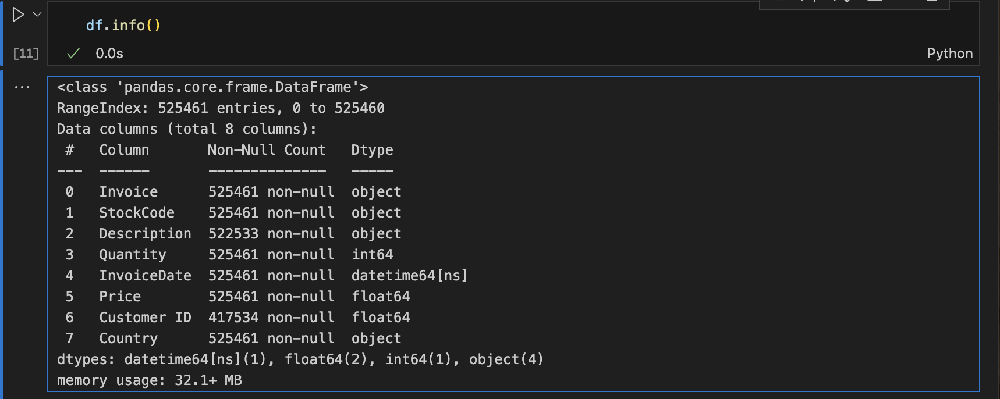

<div align='center'>
  
</div>
<br>

# 🧭 Project Outline: Customer Segmentation with K-Means Clustering

---

## 1. 💠  Introduction
- **Objective**: Segment customers of a UK-based online retail company using K-Means clustering to identify distinct customer groups based on purchasing behavior.
- **Dataset Overview**: Transactional data from the Online Retail II dataset (UCI ID: 502), covering sales from 01/12/2009 to 09/12/2011, with attributes including InvoiceNo, StockCode, Description, Quantity, InvoiceDate, UnitPrice, CustomerID, and Country.
- **Goal**: Group customers into meaningful segments to inform targeted marketing strategies and improve customer retention.


## 2. 📊 Data Understanding
- **Data Source**: UCI Machine Learning Repository (Online Retail II, ID: 502, CC BY 4.0 license).

</br> You can visit the original datasource at: 
<a href='https://archive.ics.uci.edu/dataset/502/online+retail+ii'> Click here </a>

</br>- **Import Dataset**: 

We use VSCode to execute the codes so that we have to install neccessary python libs for further using. If you use other IDE such as Google Colab then you an skip these steps of installing some of popular python libs that are already installed to Colab by default. 

</br> Install the libs that we will use to analyze the dataset

```python
pip install pandas
pip install matplotlib
pip install seaborn

```
```python
pip install scikit-learn
```

```python
import sklearn
print(sklearn.__version__)
```

</br> Import python libs for analysis and machine learninglearning:

```python
import pandas as pd
import matplotlib.pyplot as plt
import seaborn as sns

from sklearn.cluster import KMeans
from sklearn.metrics import silhouette_score
from sklearn.preprocessing import StandardScaler

# setting to make numbers displayed with 2 decimals
pd.options.display.float_format = "{:20.2f}".format

# show all columns on output
pd.set_option('display.max_columns', 999)

```

</br> We shall adjust the output display a litlte bit to review the result more efficiently using : ``` pd.options.display.float_format = "{:20.2f}".format``` and ``` pd.set_option('display.max_columns', 999)```

</br> In order to help the machine read the excel file more efficiently, We will import the openpyxl engine :

```python
pip install openpyxl
```

```python
import openpyxl
print(oepnpyxl.__vesion__)
```

```python
# read the first sheet of the file:
df = pd.read_excel('/Users/hatde/Desktop/Online Retail II/online_retail_II.xlsx', sheet_name=0)
```


- **Additional Variable Information:**
  
  - InvoiceNo: Invoice number. Nominal. A 6-digit integral number uniquely assigned to each transaction. If this code starts with the letter 'c', it indicates a cancellation.
  - StockCode: Product (item) code. Nominal. A 5-digit integral number uniquely assigned to each distinct product. 
  - Description: Product (item) name. Nominal. 
  - Quantity: The quantities of each product (item) per transaction. Numeric.	
  - InvoiceDate: Invice date and time. Numeric. The day and time when a transaction was generated. 
  - UnitPrice: Unit price. Numeric. Product price per unit in sterling (£). 
  - CustomerID: Customer number. Nominal. A 5-digit integral number uniquely assigned to each customer. 
  - Country: Country name. Nominal. The name of the country where a customer resides.

 
</br> - **Initial Exploration:**
  
  - Review 10 top rows of the dataset:

```python
df.head(10)
```

  - Assess missing values (e.g., CustomerID, Description).

```python
df.info()
```



</br> So from the result, we see that there are some missing vaues in columns Description and Customer ID.


  - Look at the descriptive analysis for numerics colums:

```python
df.describe()
```
</br> The result should be as below:

|       |  Quantity |                   InvoiceDate |     Price | Customer ID |
|------:|----------:|------------------------------:|----------:|-------------|
| count | 525461.00 |                        525461 | 525461.00 |   417534.00 |
|  mean |     10.34 | 2010-06-28 11:37:36.845017856 |      4.69 |    15360.65 |
|   min |  -9600.00 |           2009-12-01 07:45:00 | -53594.36 |    12346.00 |
|   25% |      1.00 |           2010-03-21 12:20:00 |      1.25 |    13983.00 |
|   50% |      3.00 |           2010-07-06 09:51:00 |      2.10 |    15311.00 |
|   75% |     10.00 |           2010-10-15 12:45:00 |      4.21 |    16799.00 |
|   max |  19152.00 |           2010-12-09 20:01:00 |  25111.09 |    18287.00 |
|   std |    107.42 |                           NaN |    146.13 |     1680.81 |

</br> The Min in Quantity and Price columns look weird since negative number of stocks bought by customer should not less than 0. However, we can also see the negative item quantity and price in some types of invoice for purpose of adjustment the number. Hence, we might not attempt to remove these missing value, at least for now, until we review all case of missing and hopefully decide which ones should be maintained in the dataset.

</br> We also see that there is missing values in Customer ID column. This might happen due to system errors when recording the transactions or mistake of staff during invoice issuance process. Generally speaking, our analysis is aim to cluster the customer base on RFM features, so that it does not make sense if we finish clustering the customer but end up lacking of information of those customers (which we must retreive from their Customer ID). I hope that you can also understand what I'm trying to saying.

  - Look at the descriptive of ```object``` columns:


  - Aggregated metrics per customer:
  - Verify data types (e.g., InvoiceDate as datetime).
  - Summarize key metrics (e.g., transaction count, Quantity, UnitPrice).
    

## 3. 🧹 Data Preprocessing
- **Data Cleaning:**
  - Remove or impute missing CustomerID records.
  - Filter out cancellations (InvoiceNo starting with 'C').
  - Address negative quantities or prices, if invalid.
  - Standardize Description for consistency.
- **Feature Engineering:**
  - Calculate RFM metrics:
    - Recency: Days since last purchase.
    - Frequency: Number of transactions per customer.
    - Monetary: Total spending (Quantity * UnitPrice).
  - Derive additional features (e.g., average order value, purchase diversity).
  - Aggregate data at the CustomerID level for clustering.
- **Data Transformation:**
  - Normalize/scale RFM features for K-Means clustering.
  - Handle outliers (e.g., cap extreme values in Monetary or Frequency).


## 4. 📈 Exploratory Data Analysis (EDA)
- RFM Analysis:
  - Analyze distributions of Recency, Frequency, and Monetary values.
  - Identify high-value customers and inactive customers.
- Customer Behavior:
  - Explore purchase patterns by country.
  - Examine transaction frequency and spending trends.
- Visualization:
  - Histograms/box plots for RFM metrics.
  - Scatter plots to visualize relationships between RFM variables.
  - Bar charts for country-wise customer distribution.


## 5. 🧠 Customer Segmentation with K-Means Clustering
- **Model Development:**
  - Apply K-Means clustering on RFM features.
  - Determine optimal number of clusters using:
    - Elbow method (plotting inertia vs. k).
    - Silhouette score for cluster cohesion.
  - Test different k values (e.g., 3–10 clusters).
- **Feature Selection:**
  - Use RFM metrics as primary features.
  - Optionally include derived features (e.g., average order value, country).
- **Implementation:**
  - Use scikit-learn’s KMeans module in Python.
  - Standardize features using StandardScaler.
  - Handle initialization sensitivity (e.g., multiple random starts).


## 6. 📏 Model Evaluation
- **Cluster Quality:**
  - Evaluate using silhouette score and within-cluster sum of squares.
  - Visualize clusters in 2D/3D scatter plots (e.g., Recency vs. Monetary).
- **Interpretability:**
  - Profile each cluster (e.g., “high-value frequent buyers,” “inactive low-spenders”).
  - Compare cluster characteristics (e.g., average RFM values, country distribution).
- **Validation:**
  - Test cluster stability with different random seeds.
  - Validate business relevance with domain knowledge (e.g., actionable segments).


## 7. 🛠️  Tools and Technologies
- Programming Language: Python.
- Libraries:
  - Data manipulation: pandas, numpy.
  - Visualization: matplotlib, seaborn, plotly.
  - Clustering: scikit-learn.
- Data Access:
  - Fetch dataset using ```ucimlrepo```:
 
```python
  from ucimlrepo import fetch_ucirepo
  online_retail_ii = fetch_ucirepo(id=502)
  data = online_retail_ii.data.features
```


## 8. 📝  Reporting and Visualization
- Dashboard:
  - Create an interactive dashboard (e.g., Plotly Dash) to display cluster profiles, RFM distributions, and customer counts.
- Report:
  - Summarize cluster characteristics and their business implications.
  - Provide recommendations for targeting each segment (e.g., loyalty programs for high-value customers).
- Visualizations:
  - Cluster scatter plots (e.g., Recency vs. Monetary).
  - Bar charts for cluster sizes and average RFM values.
  - Heatmaps for cross-cluster comparisons.


## 9.  📌  Conclusion and Recommendations

### Key Findings:
  - Summarize identified customer segments (e.g., high-value, frequent, inactive).
  - Highlight differences in purchasing behavior across clusters.
### Business Recommendations:
  - Develop targeted marketing strategies (e.g., discounts for inactive customers, premium offers for high-value segments).
  - Optimize resource allocation based on segment profitability.
### Future Work:
  - Incorporate additional features (e.g., product categories) for refined segmentation.
  - Explore alternative clustering methods (e.g., DBSCAN, hierarchical clustering).


## 10. 📘 References
Chen, D. (2019). Online Retail II [Dataset]. UCI Machine Learning Repository. https://doi.org/10.24432/C5CG6D.
Dua, D., & Graff, C. (2019). UCI Machine Learning Repository. University of California, Irvine. http://archive.ics.uci.edu/ml.

